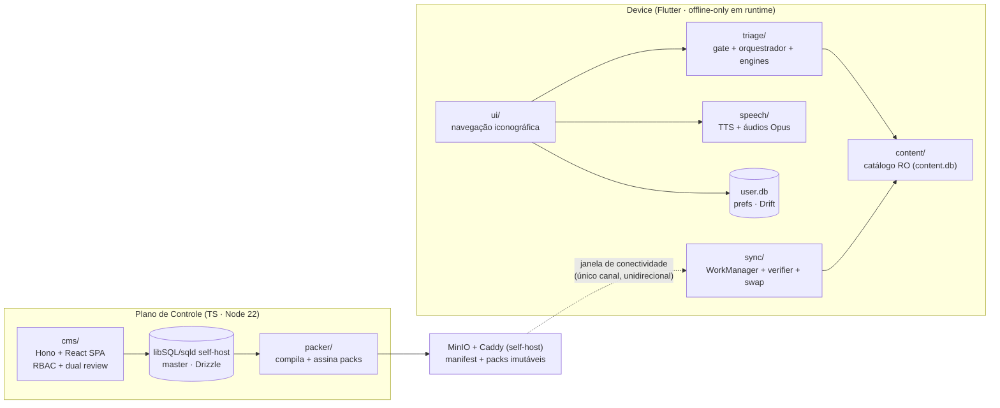
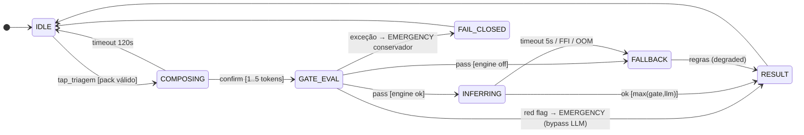
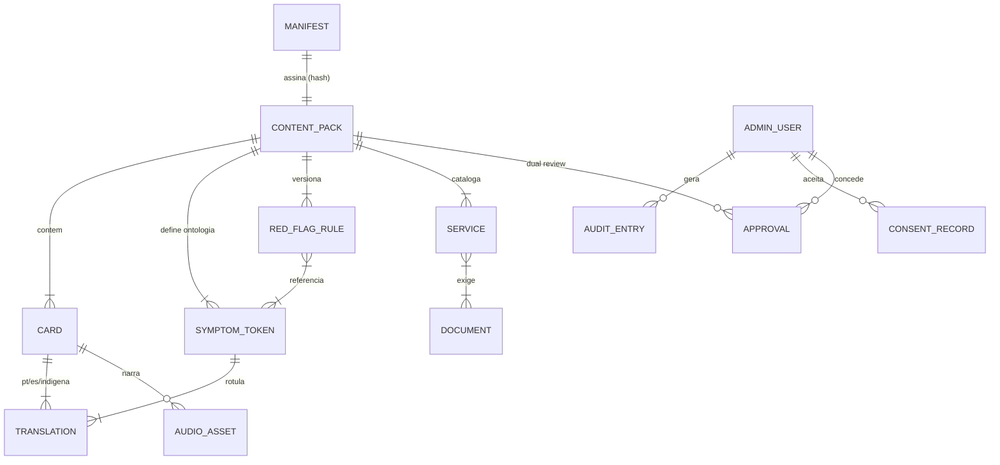

# Guia UBS — PRD Técnico (Single Source of Truth)

> **Hierarquia documental:** este PRD consolida e governa [brainstorm.md](brainstorm.md) (visão), [stack.md](stack.md) (MVTS), [espec.md](espec.md) (spec formal/FSM), [lgpd.md](lgpd.md) (conformidade) e [design.html](design.html) (protótipo navegável). Em caso de conflito, vale este documento; detalhes formais (matrizes FSM completas, invariantes proposicionais) permanecem normativos na espec.
> **Status:** DRAFT para aprovação de stakeholders. Convenções: severidade `EMERGENCY > ROUTINE_UBS`; prioridades P0/P1/P2; complexidade S/M/L.

---

## 1. Fundações e Visão de Produto

### 1.1 Resumo Executivo

Guia UBS é um aplicativo Android offline-only em runtime que orienta populações rurais, imigrantes hispanofalantes e pessoas de baixo letramento sobre **quando, onde e como** usar a Atenção Primária do SUS. Entrada exclusivamente iconográfica; triagem híbrida (gate determinístico de red flags + SLM local); resposta multimodal (cartões + voz); conteúdo atualizado por pacotes SQLite assinados, distribuídos via CDN em janelas oportunistas de conectividade. Não há caminho request-usuário→servidor: o custo marginal por usuário é ~0 e a escala é de arquivo estático.

**Proposta de valor técnica:** a única solução do domínio que funciona onde as demais falham por definição (sem internet, sem leitura, sem cadastro) — e que transforma essa restrição em arquitetura (Edge AI + conteúdo imutável assinado + zero PII).

### 1.2 Jobs-to-be-Done

| # | Job statement | Ator |
|---|---|---|
| JTBD-1 | "Quando sinto algo no corpo e não sei se é grave, quero descobrir **agora e sem internet** se preciso de emergência ou da UBS, para não perder um dia de viagem e trabalho à toa." | Morador rural / baixa alfabetização |
| JTBD-2 | "Quando preciso de atendimento e não conheço o SUS, quero entender **na minha língua e sem ler** onde ir e o que levar, para não ser barrado no balcão." | Imigrante hispanofalante |
| JTBD-3 | "Quando muda uma campanha de vacinação ou horário, quero que a população **fique sabendo sem eu imprimir cartaz**, para reduzir viagens perdidas e filas erradas." | Gestor municipal / equipe da UBS |

### 1.3 Hipóteses (o que estamos validando)

| ID | Hipótese | Validação | Critério de sucesso |
|---|---|---|---|
| H1 | Interface 100% iconográfica + áudio permite uso **sem mediação humana** pelo público-alvo | Teste de usabilidade (M2) + piloto (M6) | ≥ 80% completam triagem sem ajuda |
| H2 | Sync de oportunidade em janelas de ~30 s converge a frota de forma confiável | Rede instável simulada (M3) + piloto | ≥ 90% dos devices atualizados em ≤ 7 dias |
| H3 | SLM quantizado roda em aparelho mínimo com latência aceitável | PoC em device ≥ 4 GB RAM (M3) | Inferência p95 entre 3 s e 5 s; RAM pico ≤ 1,5 GB (ADR-003) |
| H4 | Prefeituras/ONGs funcionam como canal de distribuição (APK sideload + Play Store) | Piloto em 2 UBS | Adoção ≥ 20 usuários ativos/UBS no piloto |

Evidência atual: H1–H4 são **premissas — precisam de validação pelos métodos acima**. Nenhuma é tratada como fato.

### 1.4 Invariantes de Negócio (jamais violáveis)

Formalizadas em [espec.md §5.1](espec.md); enunciado de produto:

1. **Red flag ⇒ emergência, sempre.** O LLM nunca rebaixa severidade (`severity_final = max(gate, llm)`).
2. **O app nunca diagnostica** — apenas orienta encaminhamento; o caminho humano (ir à UBS) está sempre visível.
3. **Zero dado pessoal do usuário final** em disco, log ou rede (LGPD-RF01/RF13).
4. **Toda funcionalidade opera com rádio desligado.** Falha de LLM/TTS/sync nunca bloqueia conteúdo estático.
5. **Nenhum conteúdo sem assinatura válida e aprovação clínica** chega ao usuário (Ed25519 + dual review).
6. **Versão de pack é monotônica** — downgrade é rejeitado mesmo assinado.

### 1.5 North Star e Métricas

**North Star:** **Triagens completadas sem mediação** (proxy do valor: decisão de deslocamento informada).

| Métrica | Alvo | Captura técnica |
|---|---|---|
| Triagens completadas / dispositivo ativo | tendência ↑ | Contadores agregados por coorte (município+versão, k ≥ 20), enviados só na janela de sync — sem device ID (LGPD-RF14) |
| Taxa de resultado EMERGENCY vs ROUTINE | monitorada (anomalia = regra ruim) | Mesmo pipeline agregado |
| `fallback_rate` (LLM → regras) | < 10% | Contador agregado; proxy da saúde do FFI (Risco R1) |
| Convergência de packs | ≥ 90% em ≤ 7 dias | Versão de pack reportada no ping agregado de sync |
| Acerto de red flags | **100%, pré-produção** | Suite golden clínica em CI — nunca medida em produção com dados reais |
| Crash-free sessions | ≥ 99,5% | Crash handler local, upload agregado na janela de sync |

---

## 2. Escopo Funcional e Comportamental

### 2.1 Arquitetura de Módulos (Bounded Contexts)

Regra de dependência: `ui → triage → content ← sync`; `speech` é folha; o **artefato assinado** é o único canal entre os dois mundos — acoplamento temporal zero. Análise de acoplamento (Ca/Ce) em [espec.md §2.2](espec.md).

### 2.2 Matriz de Capacidades

| ID | Requisito | Ator | Complexidade | Risco | Release |
|---|---|---|---|---|---|
| CAP-01 | Seleção de idioma por ícone (pt/es), persistida | Usuário final | S | Baixo | MVP |
| CAP-02 | Navegação iconográfica (bottom nav 3 abas, prof. ≤ 4, zero dead-ends) | Usuário final | M | Médio (H1) | MVP |
| CAP-03 | Composição visual de sintomas (mapa corporal + 1..5 tokens) | Usuário final | M | Médio (H1) | MVP |
| CAP-04 | Gate determinístico de red flags (pré-LLM, fail-closed) | Sistema | M | **Crítico** (clínico) | MVP |
| CAP-05 | Inferência SLM local (llama.cpp FFI, timeout 5 s) | Sistema | L | **Alto** (R1/H3) | MVP |
| CAP-06 | Resposta multimodal (cartão + TTS pt/es) | Usuário final | M | Médio (TTS de ROM) | MVP |
| CAP-07 | Guia UBS vs UPA/Hospital (conteúdo estático) | Usuário final | S | Baixo | MVP |
| CAP-08 | Orientador de documentação | Usuário final | S | Baixo | MVP |
| CAP-09 | Fluxograma de atendimento (4 passos) | Usuário final | S | Baixo | MVP |
| CAP-10 | Sync de oportunidade (retomável, backoff, circuit breaker) | Sistema | L | **Alto** (H2) | MVP |
| CAP-11 | Verificação Ed25519 + swap atômico + anti-downgrade | Sistema | M | **Crítico** (segurança) | MVP |
| CAP-12 | Degradação graciosa (kill switch → regras puras) | Sistema | M | Alto | MVP |
| CAP-13 | Tela de privacidade (opt-out telemetria, apagar dados, aviso em áudio) | Usuário final | S | Baixo (obrig. LGPD-RF03) | MVP |
| CAP-14 | CMS: edição de catálogo + RBAC 3 papéis + 2FA + dual review clínico | Admin/Revisor | L | Alto (clínico) | MVP |
| CAP-15 | Packer: compilação, assinatura e publicação de packs | CI | M | Médio | MVP |
| CAP-16 | Calendário vacinal interativo | Usuário final | M | Médio (dados municipais) | v1.1 |
| CAP-17 | Navegador da farmácia básica | Usuário final | M | Médio (dados municipais) | v1.1 |
| CAP-18 | Saúde da mulher/pré-natal; programas sociais; áudios indígenas; modo ACS | Usuário final/ACS | L | Alto | v2 |

### 2.3 Fluxos Críticos como FSM

As matrizes completas (`Estado + Gatilho + Guarda → Ação → Estado`) são normativas em [espec.md §4](espec.md). Resumo operacional dos dois fluxos críticos e suas estratégias de recuperação:

**FSM-A — Triagem** (estados: `IDLE → COMPOSING → GATE_EVAL → [INFERRING] → RESULT`, erro: `FAIL_CLOSED`):

- **Recuperação:** timeout/erro de inferência → **fallback determinístico** (nunca retry do LLM — latência de triagem é SLO); exceção no gate → **fail-closed** para EMERGENCY. Sem rollback: a sessão é efêmera e imutável pós-submit (idempotente por construção).

**FSM-B — Ciclo de vida do pack** (estados: `STEADY → MANIFEST_FETCH → DOWNLOADING → VERIFYING → STAGED → COMMITTED`, erros: `RETRYABLE`, `REJECTED`):

- **Retry:** backoff exponencial + jitter na janela; entre janelas, o próprio WorkManager reagenda. **Circuit breaker:** ≥ 5 falhas na janela → abre até a próxima.
- **Rollback:** o pack vN é retido até o commit do vN+1 (rename atômico = commit point); crash no meio do swap resolve no cold start (re-verificação de assinatura, INV-3).
- **Compensação:** desnecessária — não há transação distribuída; o pior estado alcançável é "continua no vN íntegro".
- **Estado absorvente evitado:** `REJECTED` sai via qualquer manifest de versão superior (um pack ruim não brica a frota).

### 2.4 Trade-off — decisões comportamentais

| Decisão | Opção A (escolhida) | Opção B | Por que A |
|---|---|---|---|
| Motor de triagem | Gate determinístico **+ SLM local** | Só regras (sem LLM) | Regras cobrem segurança, mas não nuance de combinações não previstas; o LLM agrega cobertura com o gate como teto de risco. B permanece como kill switch (CAP-12) — o produto degrada, não morre |
| Inferência | On-device (llama.cpp) | Cloud API | Requisito estrutural: usuários sem internet. Cloud quebraria a proposta de valor inteira e criaria tratamento de dado sensível (LGPD-RF13) |
| Identidade | Sem conta de usuário | Login/perfil | Conta agregaria personalização marginal e destruiria o moat de confiança (imigrantes irregulares) + criaria toda a superfície LGPD que hoje não existe |
| Atualização de conteúdo | Pack SQLite completo/delta, swap atômico | Sync incremental por linha (row-level) | Row-sync exige resolução de conflito e estado por device; o pack imutável assinado dá integridade + rollback + sneakernet de graça |

---

## 3. Arquitetura de Dados e Integridade

### 3.1 Modelo Conceitual

**Imutabilidade por classe:**
- `CONTENT_PACK` + `MANIFEST`: **imutáveis** após assinatura (endereçados por hash; mudança = nova versão).
- `RED_FLAG_RULE`: append por versão de pack; nunca editada in-place após aprovação.
- `AUDIT_ENTRY`, `CONSENT_RECORD`, `APPROVAL`: **append-only** (sem UPDATE/DELETE — constraint + permissão; LGPD-RT05).
- `ADMIN_USER`, catálogo em edição no CMS: mutáveis, com trilha.

### 3.2 Estratégia de Persistência (por módulo)

| Módulo | Tecnologia | SQL/NoSQL | Justificativa |
|---|---|---|---|
| Catálogo master | libSQL/`sqld` self-host + Drizzle | SQL | Integridade referencial real (regra→token, serviço→documento) e traduções normalizadas; violação aqui é incidente clínico, não bug |
| `content.db` (device) | SQLite RO distribuído | SQL | Mesmo dialeto do master ⇒ packer sem ETL; consultas relacionais locais; arquivo único = unidade de swap/assinatura |
| `user.db` (device) | SQLite via Drift | SQL | Type-safe em Dart; escopo minúsculo (prefs, estado de sync) |
| Telemetria agregada | Contadores em arquivo local → endpoint de ingestão | n/a | Não é banco de dado pessoal por design (k ≥ 20; LGPD-RF14) |
| Documento/NoSQL | — rejeitado | — | Duplicaria traduções e empurraria validação referencial para a aplicação (ver [stack.md §2.1](stack.md)) |

### 3.3 Evolução de Schema sem Downtime

- **Contrato central:** `pack-schema.json` versionado (`schemaVersion` major.minor) gerado do schema Drizzle; codegen Dart em CI — mudança de schema quebra o build do app no mesmo PR ([stack.md §3.3](stack.md)).
- **CMS/master:** migrações **expand → migrate → contract** via drizzle-kit; deploy do CMS só depois da fase expand (colunas novas nullable/default); contract apenas quando nenhuma versão antiga do CMS roda. Downtime zero é trivial: o CMS é interno e o app **não depende dele em runtime**.
- **Device:** o app **nunca migra conteúdo** — recebe o `content.db` pronto e troca o arquivo. Compatibilidade: manifest declara `schemaVersion`; app rejeita major incompatível (fica no pack atual até atualizar o binário — degradação segura, não quebra). `user.db`: migrações Drift aditivas.
- **Janela de compatibilidade:** packer publica packs no **menor schemaVersion suportado pela frota ativa** até que a adoção do app novo cruze o limiar definido (política: ≥ 90%).

### 3.4 Sincronização e Concorrência

| Preocupação | Mecanismo |
|---|---|
| Idempotência do sync | Staging keyed por `packHash`; rename atômico idempotente; re-execução do WorkManager encontra estado commitado ⇒ noop |
| Concorrência device (sync × triagem) | Guard de quiescência: swap só com FSM-A em IDLE; no-wait (adia, não bloqueia); sem ciclo de locks ⇒ sem deadlock ([espec.md §4.4](espec.md)) |
| Concorrência no CMS | Travamento **otimista** por `version` (coluna incremental) nas entidades editáveis; conflito ⇒ 409 + merge manual no editor |
| Ordem/consistência da frota | BASE com convergência por versão monotônica + artefatos imutáveis por hash; sem relógio como autoridade (clock skew rural) |
| Anti-replay/downgrade | Guard `manifest.version > vN` mesmo com assinatura válida |

---

## 4. Requisitos Não Funcionais e Segurança

### 4.1 Performance & SLOs

| Superfície | SLO | Medição |
|---|---|---|
| Gate de red flags | < 50 ms (síncrono) | Bench em CI + telemetria agregada |
| Inferência SLM (device ≥ 4 GB) | p95 entre 3 s e 5 s; timeout hard 5 s | Idem; `fallback_rate` **por coorte de aparelho** como guardrail |
| Resposta total da triagem (toque→cartão) | p95 < 4 s | Telemetria agregada |
| Cold start do app | < 2,5 s em device de entrada | Bench M5 |
| `GET manifest.json` (edge Caddy/espelhos) | p99 < 300 ms; 99,5% disponibilidade (BASE tolera indisponibilidade) | Métricas do Caddy — única superfície de rede do app |
| API CMS | p95 < 400 ms | APM do plano de controle |
| Footprint | APK+modelo+pack ≤ **1,2 GB**; APK base 50–80 MB; modelo 700 MB–1,2 GB; disco livre ≥ 3 GB; RAM inferência ≤ 1,5 GB | Pipeline de release |
| Estabilidade | Crash-free ≥ 99,5%; 72 h offline sem crash | M5 + telemetria |

### 4.2 Segurança por Design

**Modelo de ameaças simplificado (ativos: conteúdo clínico, chave de assinatura, contas CMS):**

| Ameaça | Vetor | Mitigação |
|---|---|---|
| Conteúdo clínico malicioso na frota | CDN/bucket comprometido; MITM | Ed25519 do manifest + SHA-256 dos artefatos; chave pública embarcada; CDN tratada como não-confiável |
| Replay/downgrade de pack antigo assinado | CDN comprometida | Monotonicidade de versão (INV-7) |
| Comprometimento da chave privada | Vazamento em CI/dev | Chave em cofre offline/HSM; assinatura só no CI com aprovação; **dual-key embarcada** para rotação sem release; blast radius limitado |
| Takeover de conta CMS | Phishing/credential stuffing | 2FA TOTP obrigatório; bloqueio progressivo; sessões ≤ 24 h |
| Conteúdo incorreto por insider/erro | Editor malicioso ou descuidado | Dual review (editor ≠ aprovador, enforced); trilha append-only; suite golden clínica no packer |
| Supply chain do app | Dependência comprometida | Lockfiles; auditoria de dependências em CI; lista de bloqueio de SDKs de ads/tracking (LGPD-RF16) |
| Reidentificação via telemetria | Cruzamento de coortes pequenas | k-anonimato ≥ 20; sem IDs persistentes; granularidade diária (LGPD-RF14) |

**Identidade:** usuário final — **nenhuma** (decisão de produto, ver §2.4). Plano de controle — **RBAC** 3 papéis (Editor, Revisor clínico, Admin) com segregação edição×aprovação; ABAC desnecessário nesta escala (revisar se surgir multi-tenancy por município com equipes próprias).

**Criptografia:** TLS 1.2+ em trânsito (Caddy/Let's Encrypt); repouso criptografado no VPS (volume LUKS provisionado pelo Ansible); Argon2id para senhas; Ed25519 para artefatos; segredos fora do código (env do host, sem SaaS de cofre).

### 4.3 Acessibilidade e UX Técnica

- **Baseline WCAG 2.1 AA** (alvo estendido 2.2 AA): contraste ≥ 4.5:1, alvos ≥ 64 dp (acima do mínimo da 2.2), foco visível, `prefers-reduced-motion` respeitado, semântica de acessibilidade (TalkBack) em todos os controles.
- **Além do WCAG (público de baixo letramento):** zero texto obrigatório; toda informação essencial disponível por ícone + áudio; navegação linear; máx. 8 elementos/tela.
- **Performance de interface (equivalentes Flutter de LCP/FID):** primeiro frame útil < 2 s (device de entrada); resposta visual a toque < 100 ms; jank < 1% dos frames (budget 16 ms); feedback tátil/visual em todo CTA ([design.html](design.html) demonstra o padrão).

---

## 5. Estratégia de Desenvolvimento e DX

### 5.1 Ambiente de Desenvolvimento (reprodutibilidade)

- **Plano de controle:** `docker compose up` sobe `sqld` + MinIO + Caddy + CMS + packer one-shot ([stack.md §7](stack.md)) — o compose é a própria topologia de produção; imagens pinadas por versão; `.env` de exemplo versionado, segredos reais fora do repo.
- **App:** Flutter no host + emulador/device físico apontando para o MinIO local; modelo GGUF baixado por script com checksum verificado (não versionado no git).
- **CI:** build do APK na imagem `cirruslabs/flutter` pinada; matriz mínima de devices de entrada no farm de testes; lockfiles (`pubspec.lock`, `package-lock.json`) obrigatórios.
- **Paridade:** o mesmo packer que roda no compose local roda no CI — um só caminho de empacotamento.

### 5.2 Contratos de Interface

| Interface | Padrão | Versionamento |
|---|---|---|
| App ← CDN | **Arquivos estáticos** (manifest.json + pack) — não é API | `schemaVersion` no manifest; contrato `pack-schema.json` no repo; app rejeita major incompatível |
| Admin SPA ↔ CMS | REST tipado (Hono + Zod, OpenAPI gerado; RPC client `hono/client`) | Interno, mesma versão deployada junto — sem versionamento público |
| TS → Dart | JSON Schema → codegen freezed em CI | Quebra de schema ⇒ quebra de build no mesmo PR |
| gRPC/GraphQL | — rejeitados | O app não fala com servidor; o CMS tem ~15 endpoints internos — o custo de infraestrutura de ambos não paga nada aqui |

### 5.3 Testabilidade (onde concentrar esforço)

| Camada | Esforço | O quê |
|---|---|---|
| **Unitário (máximo)** | 🟥🟥🟥 | Gate de red flags: **tabela golden clínica, pass 100%, zero falso negativo tolerado** (dual review da tabela); FSMs testadas linha a linha contra as matrizes da espec; RuleOnlyEngine ≡ gate (mesma tabela, teste de equivalência) |
| **Contrato** | 🟥🟥 | `pack-schema.json` (TS↔Dart); validação de integridade referencial regra→token no packer antes de assinar; schema de telemetria vs allowlist (LGPD) |
| **Integração** | 🟥🟥 | Sync em rede instável simulada (corte no meio do download, dupla execução, crash no swap); airplane mode end-to-end (INV-4); verificação de assinatura com packs adulterados |
| **Eval clínico** | 🟥🟥 | Harness de casos dourados contra gate+SLM a cada troca de modelo/prompt (determinismo: temperatura 0, seed fixa) |
| **E2E/UI (mínimo)** | 🟥 | 3 jornadas críticas (triagem verde, triagem vermelha, sync) em device farm |

Racional: o risco do produto mora nas regras clínicas, nos contratos e na resiliência do sync — não em navegação de telas. QA deriva casos diretamente das matrizes FSM ([espec.md §4](espec.md)) e dos critérios de aceitação ([espec.md §1.2](espec.md), [lgpd.md §8](lgpd.md)).

---

## 6. Roadmap de Entrega e Mitigação

### 6.1 MVP (núcleo duro que prova a hipótese)

CAP-01…CAP-15 (matriz §2.2). Corte: prova H1 (iconográfico sem mediação) + H2 (sync confiável) + H3 (SLM em device de entrada). Fora: vacinas/farmácia (dados municipais curados — v1.1), línguas indígenas e modo ACS (v2).

### 6.2 Milestones Técnicos

| Fase | Semanas | Entregas | Riscos que valida | Gate de saída |
|---|---|---|---|---|
| **Fase 1 — PoC** | 1–7 (M1–M3) | Wireframes validados em campo; protótipo Figma/HTML; PoC SLM em device ≥ 4 GB; PoC sync em rede instável; esquema de dados + pipeline de pack assinado | R1 (FFI), H3 (latência), H2 (sync), H1 parcial (usabilidade de protótipo) | Inferência p95 entre 3 s e 5 s; sync resume após corte; ≥ 80% conclusão de tarefas no teste de protótipo |
| **Fase 2 — Alpha/Beta** | 7–21 (M4–M6) | 5 sprints de módulos (casca+TTS → triagem → encaminhamento+fluxo → documentos+privacidade → sync+CMS); testes M5 (perf/segurança/72 h); piloto UAT em 2 UBS | H1 (campo real), R5 (conteúdo clínico), R7 (TTS) | Zero orientação clinicamente incorreta no piloto; aprovação formal dos gestores; crash-free ≥ 99,5% |
| **Fase 3 — GA** | 22+ (M7) | Play Store + F-Droid + APK sideload (Bluetooth/SD); telemetria agregada ativa; ciclo mensal de packs; delta packs (bsdiff) quando pack > 10 MB; sharding por município; v1.1 (vacinas/farmácia) | H4 (adoção), R6 (custo), escala de conteúdo | ≥ 90% convergência em 7 dias; custo/usuário ~0 confirmado; processo de curadoria municipal operando |

### 6.3 Matriz de Riscos

| ID | Risco | Prob. | Impacto | Contingência |
|---|---|---|---|---|
| R1 | Binding FFI llama.cpp quebra/abandonado ([stack.md §6](stack.md)) | Alta | Alto | Interface `TriageEngine` com 3 implementações; kill switch para regras puras (CAP-12) — produto degrada, não para; fallback MediaPipe |
| R2 | Público-alvo não completa triagem sem mediação (H1 falha) | Média | **Crítico** (invalida a tese) | Detectar cedo (M1/M2 com usuários reais, incl. baixo letramento); iterar gramática de ícones; pivô parcial: modo assistido por ACS vira o produto |
| R3 | Reidentificação via telemetria (coorte pequena) | Baixa | Alto (legal/confiança) | k ≥ 20 enforced no pipeline; revisão do encarregado por mudança de schema; capacidade de desligar telemetria por release |
| R4 | Comprometimento da chave de assinatura | Baixa | **Crítico** | Cofre offline/HSM; dual-key para rotação; anti-downgrade limita replay; runbook de revogação + pack de emergência |
| R5 | Conteúdo clínico incorreto distribuído | Média | **Crítico** | Dual review obrigatório; suite golden no packer (bloqueia assinatura); auditoria por profissional (M5/M6); correção via pack em horas (não depende de release) |
| R6 | Banda/disponibilidade do VPS único de conteúdo (stack 100% self-host) | Média | Baixo | Espelhos estáticos por rsync (Ed25519 dispensa confiança no espelho); BASE tolera indisponibilidade — frota só converge mais devagar |
| R7 | Qualidade/ausência de TTS do sistema em ROMs de entrada | Média | Médio | Detecção no boot; resposta visual íntegra (INV-8); v2 antecipável: áudios gravados como fallback universal |
| R8 | Baixa adoção municipal (H4 falha) | Média | Alto | Canal duplo: ONGs/ACS além de prefeituras; sneakernet por APK reduz dependência de infraestrutura local; piloto gera casos de referência |

### 6.4 Rastreabilidade (funcionalidade → requisito → métrica)

| Capacidade | Requisitos (espec/LGPD) | Hipótese | Métrica |
|---|---|---|---|
| CAP-02/03 (navegação + composição) | RF-02, RF-03; RNF-06 | H1 | ≥ 80% triagens sem mediação |
| CAP-04 (gate) | RF-04; INV-1/2 | — (invariante) | 100% red flags em CI; taxa EMERGENCY monitorada |
| CAP-05 (SLM) | RF-05; RNF-02/03 | H3 | p95 entre 3 s e 5 s; `fallback_rate` < 10% em aparelhos recomendados (6–8 GB) |
| CAP-06 (multimodal) | RF-06; LGPD-RF10 | H1 | Compreensão do aviso/resposta sem mediação (teste M2/M6) |
| CAP-10/11 (sync + integridade) | RF-10, RF-11; INV-3/7 | H2 | ≥ 90% convergência ≤ 7 dias; zero pack inválido ativado |
| CAP-12 (degradação) | RF-12 (espec); INV-8 | — | Triagem completa com engine desligado (teste M5) |
| CAP-13 (privacidade) | LGPD-RF03/13/14 | — | Auditoria de tráfego limpa; k ≥ 20 enforced |
| CAP-14/15 (CMS + packer) | LGPD-RF11; RF-04 espec | R5 | Zero conteúdo sem dual review; suite golden verde por pack |

---

*Aprovação necessária de: produto, engenharia, revisor clínico responsável e encarregado (DPO). Alterações a invariantes (§1.4) exigem revisão formal da espec e novo RIPD quando tocarem dados.*
