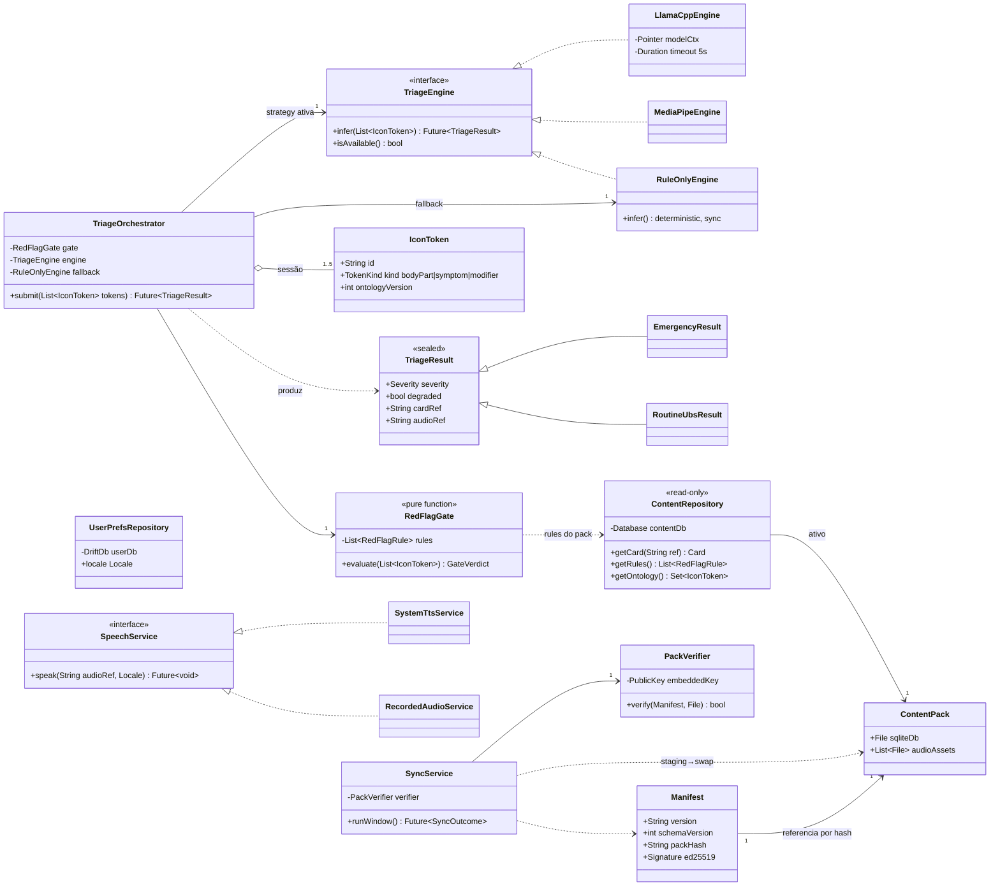
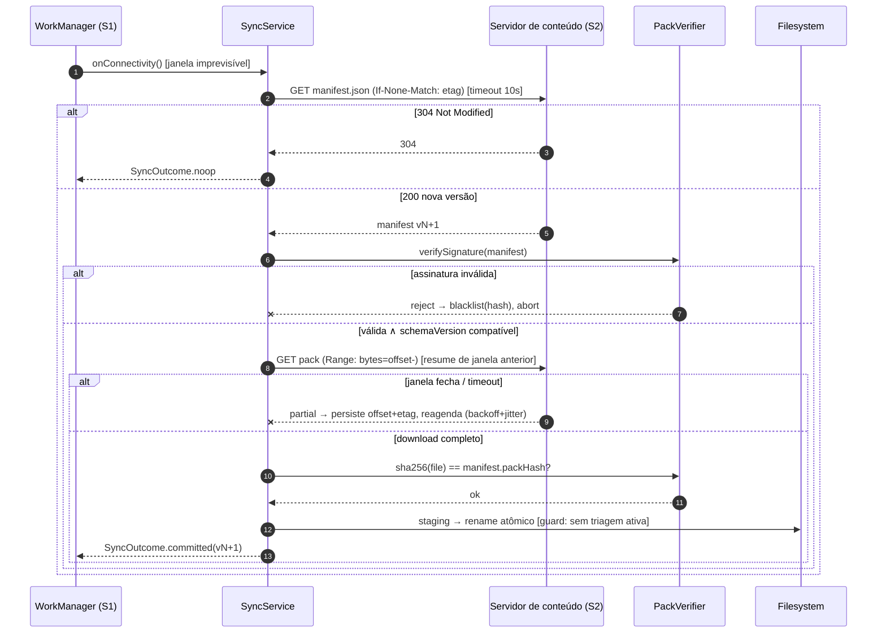
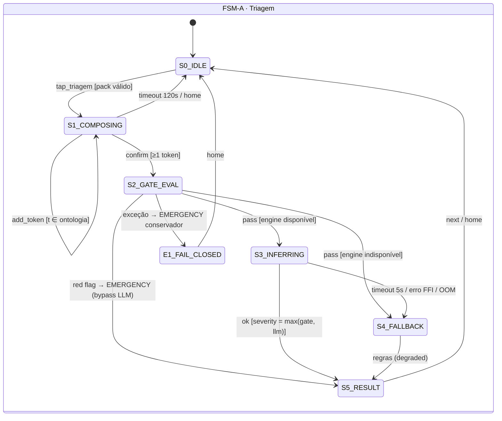
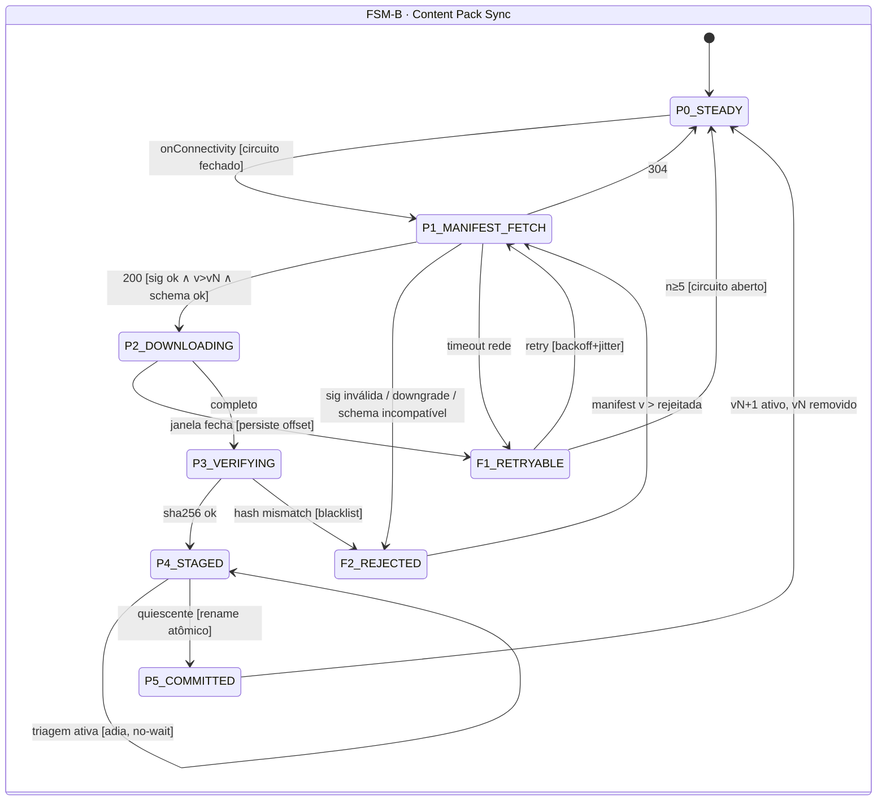

# Guia UBS — Especificação Técnica de Engenharia (Spec)

> Documentos-base: [brainstorm.md](brainstorm.md) (domínio) e [stack.md](stack.md) (MVTS). Esta spec formaliza comportamento, estrutura e falhas do MVP (RF-01…RF-12). Convenção de severidade clínica: `EMERGENCY > ROUTINE_UBS`.

---

## 1. Requisitos e Análise de Domínio

### 1.1 Resumo Executivo

**Problema:** populações rurais, imigrantes hispanofalantes e pessoas de baixo letramento não conseguem descobrir offline quando/onde/como usar os serviços da UBS, gerando deslocamentos inúteis e sobrecarga de UPAs.
**Solução:** app Flutter offline-only em runtime, com entrada exclusivamente iconográfica, triagem híbrida (gate determinístico de red flags + SLM local via llama.cpp/FFI), resposta multimodal (cartões + TTS) e atualização de conteúdo por pacotes SQLite assinados (Ed25519) distribuídos via CDN em janelas oportunistas de conectividade.
**Valor técnico:** eliminação do caminho request-usuário→servidor (custo marginal ~0, escala por CDN), determinismo verificável na camada clínica crítica (zero falso negativo por construção + testes golden), e consistência de conteúdo por versionamento monotônico de artefatos imutáveis — sem sync bidirecional, sem CRDT, sem estado de servidor por usuário.

### 1.2 Matriz de Requisitos

#### Funcionais

| ID | Requisito | Critérios de Aceitação Técnicos |
|---|---|---|
| RF-01 | Seleção de idioma por ícone (pt/es), persistida | Troca reflete em UI+voz do TTS em < 200 ms; persistida em `user.db`; zero texto obrigatório |
| RF-02 | Navegação 100% iconográfica | Grade inicial 6–8 ícones; profundidade máx. 4; botões voltar/casa em toda tela; zero dead-ends (toda tela possui ≥ 1 transição de saída) |
| RF-03 | Composição visual de sintomas | 1..5 `IconToken` por sessão; cada token validado contra a ontologia do pack ativo; token inválido rejeitado com feedback visual |
| RF-04 | Gate determinístico de red flags avaliado ANTES de qualquer inferência | Função pura e total sobre o domínio de tokens; 100% dos casos da tabela `red_flag_rules` → `EMERGENCY`; suite golden com pass criteria 100% (zero falso negativo tolerado) |
| RF-05 | Inferência SLM local para casos não red-flag | p95 **entre 3 s e 5 s** em device mínimo (≥ 4 GB RAM) — [ADR-003](stack.md); contexto máximo de **512–1024 tokens por atendimento**; timeout hard de 5 s dispara RF-12; prompt determinístico (decodificação gulosa, temperatura 0) |
| RF-06 | Resposta multimodal: cartão visual + TTS | Áudio no idioma ativo; renderização do cartão independe do TTS (falha de TTS ⇒ resposta apenas visual, nunca bloqueio) |
| RF-07 | Guia de encaminhamento UBS vs. UPA/Hospital | Conteúdo 100% oriundo do `content.db` ativo; navegável offline |
| RF-08 | Orientador de documentação por serviço | Idem RF-07; imagens dos documentos embarcadas no pack |
| RF-09 | Fluxograma de atendimento da unidade | Cartões sequenciais ordenados por `step_order`; idem RF-07 |
| RF-10 | Sincronização de oportunidade em background | Agendada via WorkManager (`NetworkType.connected`); download retomável (HTTP Range + ETag); manifest + delta operáveis em janela de 30 s |
| RF-11 | Verificação de integridade e swap atômico de pack | Assinatura Ed25519 do manifest + SHA-256 dos artefatos verificados antes do swap; pack inválido jamais ativado; swap via rename atômico; re-verificação no cold start |
| RF-12 | Degradação graciosa da triagem (kill switch) | Com engine LLM inoperante, a triagem completa via `RuleOnlyEngine` com resultado conservador; flag `degraded=true` no resultado |

#### Não Funcionais

| ID | Requisito | Critérios de Aceitação Técnicos |
|---|---|---|
| RNF-01 | Offline total em runtime | Toda funcionalidade do ator A1 executável com rádio desligado (verificado em teste de integração com airplane mode) |
| RNF-02 | Latência de triagem | Gate < 50 ms; inferência p95 entre 3 s e 5 s; resposta total (toque final → cartão) p95 < 6 s |
| RNF-03 | Footprint | APK + modelo + pack ≤ **1,2 GB** ([ADR-003](stack.md)); APK base 50–80 MB; modelo SLM 700 MB–1,2 GB (baixado no 1º acesso ou embarcado como asset); **espaço livre em disco ≥ 3 GB** verificado ANTES do download; RAM pico de inferência ≤ 1,5 GB |
| RNF-04 | Privacidade (LGPD by design) | Zero PII em disco, logs e rede; telemetria apenas agregada por coorte (município+versão), nunca por device |
| RNF-05 | Integridade de conteúdo | Cadeia de confiança: chave pública embarcada → manifest assinado → hashes dos artefatos; CDN tratada como não-confiável |
| RNF-06 | Acessibilidade | Alvos de toque ≥ 64 dp; contraste WCAG 2.2 AA; semântica de cor fixa (verde/vermelho/azul); zero texto obrigatório |
| RNF-07 | Estabilidade | 72 h de uso simulado offline sem crash; crash-free sessions ≥ 99,5% |
| RNF-08 | Energia | Inferência apenas sob demanda; sem wakelocks persistentes; sync limitado à janela do WorkManager |
| RNF-09 | Compatibilidade | Android 8.0+ (minSdk 26), arm64-v8a prioritário; **RAM mínima 4 GB, recomendada 6–8 GB** ([ADR-003](stack.md)); degradação verificada em SoCs de entrada — RAM mínima não garante classe de CPU, e SoCs dominados por Cortex-A55 operam predominantemente via `RuleOnlyEngine` |

### 1.3 Atores e Fronteiras

| Ator | Tipo | Interação |
|---|---|---|
| A1 Usuário final | Humano (anônimo, sem identidade) | Toques em ícones; consome cartões + áudio |
| A2 Admin de conteúdo municipal | Humano | Edita catálogo no CMS (autenticado, Better Auth) |
| A3 Revisor clínico | Humano | Aprova `red_flag_rules` e conteúdo antes do empacotamento (dual review) |
| S1 Android OS | Sistema | WorkManager (agenda sync), engine TTS do sistema |
| S2 Servidor de conteúdo (MinIO+Caddy self-host / espelhos) | Sistema | Serve `manifest.json` + packs imutáveis (não-confiável) |
| S3 Packer (CI) | Sistema | Compila, assina (Ed25519) e publica packs |
| S4 libSQL/`sqld` (self-host) | Sistema | Master DB do plano de controle |

**Dentro da fronteira:** app device (UI, gate, engines, sync, repositórios), plano de controle (CMS, packer, buckets).
**Fora da fronteira:** sistemas do SUS (prontuário, agendamento), Play Store, engine TTS (dependência do SO — tratada como serviço externo falível), conectividade (não garantida por definição).

---

## 2. Modelagem Estrutural

### 2.1 Diagrama de Classes

Padrões aplicados: **Strategy** (`TriageEngine`, `SpeechService`), **Facade/Orchestrator** (`TriageOrchestrator`), **Repository** (`ContentRepository`, `UserPrefsRepository`), **Observer** (providers Riverpod expõem `TriageSessionState` reativo à UI), sealed types para resultados (estados impossíveis irrepresentáveis).



### 2.2 Decomposição de Módulos e Acoplamento

| Módulo | Responsabilidade única | Acoplamento eferente (Ce) | Acoplamento aferente (Ca) |
|---|---|---|---|
| `triage/` (gate + orchestrator + engines) | Decisão de encaminhamento | `content/` (regras, ontologia) | UI; **maior Ca do sistema — por isso o gate é função pura sem side effects (testável por tabela)** |
| `content/` (repos RO + pack) | Acesso ao catálogo ativo | SQLite (driver) | Todos os módulos de feature — estável por design (interface RO minúscula) |
| `sync/` (WorkManager + verifier + swap) | Ciclo de vida do pack | rede, filesystem, `content/` (invalidação) | Nenhum módulo de feature depende dele (fire-and-forget) |
| `speech/` | Saída de áudio | Engine do SO / assets Opus | UI (opcional: falha não propaga) |
| `ui/` (navegação iconográfica) | Apresentação e input | `triage/`, `content/`, `speech/` | — |
| CMS/packer (TS, fora do device) | Curadoria, empacotamento, assinatura | `sqld`, MinIO | Nenhum (assíncrono via artefatos) |

Regra de dependência: `ui → triage → content ← sync`; `speech` é folha; nenhuma dependência cíclica. O único canal entre plano de controle e device é o **artefato assinado** — acoplamento temporal zero (nenhum dos lados precisa estar online simultaneamente).

---

## 3. Dinâmica e Comportamento

### 3.1 Diagrama de Sequência — Triagem (caminho feliz + timeout + degradação)

```mermaid
sequenceDiagram
    autonumber
    actor U as Usuário (A1)
    participant UI as UI (Riverpod)
    participant OR as TriageOrchestrator
    participant GT as RedFlagGate
    participant EN as LlamaCppEngine
    participant FB as RuleOnlyEngine
    participant CR as ContentRepository
    participant SP as SpeechService

    U->>UI: toques em ícones (1..5 tokens)
    UI->>OR: submit(tokens)
    OR->>GT: evaluate(tokens)  [síncrono, <50ms]
    alt red flag detectada (RF-04)
        GT-->>OR: GateVerdict.EMERGENCY
        Note over OR,EN: LLM BYPASSADO — INV-1
    else sem red flag
        GT-->>OR: GateVerdict.PASS
        OR->>+EN: infer(tokens)  [async, timeout 5s]
        alt inferência ok
            EN-->>-OR: TriageResult(severity)
            Note over OR: severidade_final = max(gate, llm) — nunca rebaixa
        else timeout / erro FFI / OOM (RF-12)
            EN--xOR: TimeoutException | FfiError
            OR->>FB: infer(tokens)  [síncrono, determinístico]
            FB-->>OR: TriageResult(degraded=true)
        end
    end
    OR->>CR: getCard(result.cardRef)
    CR-->>OR: Card + audioRef
    OR-->>UI: TriageResult
    UI-->>U: renderiza cartão (não bloqueia por áudio)
    par áudio fire-and-forget (RF-06)
        UI->>SP: speak(audioRef, locale)
        alt TTS indisponível
            SP--xUI: erro (log local; sem retry, sem UI de erro)
        end
    end
```

### 3.2 Diagrama de Sequência — Sync de Oportunidade (assíncrono, retomável)



### 3.3 Fluxo Operacional

**Caminho feliz (triagem):**
1. `tokens ← []`; a cada toque, `token` validado contra `ontology(pack_ativo)`; inválido ⇒ rejeição com feedback visual, estado inalterado.
2. Confirmação ⇒ snapshot imutável de `tokens` (a sessão não é mutável após submit — idempotência de reprocessamento).
3. `verdict ← gate(tokens)` — função pura, total, O(|rules|).
4. `verdict = EMERGENCY` ⇒ resultado imediato (passo 6). Senão: `r ← engine.infer(tokens)` com prompt determinístico (temperatura 0, seed fixa — mesma entrada ⇒ mesma saída, requisito de auditabilidade clínica).
5. `severity_final ← max(verdict.severity, r.severity)` (monotonicidade de severidade, INV-1).
6. Resolução de `cardRef/audioRef` no `content.db`; render; TTS em paralelo fire-and-forget.

**Fluxos alternativos:**
- **A1 — engine indisponível no boot** (modelo corrompido/RAM insuficiente): `TriageOrchestrator` liga direto no `RuleOnlyEngine`; UI idêntica; `degraded=true` para telemetria.
- **A2 — inatividade 120 s durante composição:** sessão descartada, retorno ao idle (nenhum estado parcial persiste).
- **A3 — TTS ausente (ROM sem engine):** resposta apenas visual; detecção única no boot, sem tentativas repetidas.
- **A4 — pack recém-swapado entre sessões:** próxima sessão carrega ontologia/regras do novo pack; sessões nunca atravessam versões de pack (guard de swap).

**Tratamento de exceções (algorítmico):**
```
try infer(tokens) within 5s
  on TimeoutException | FfiException | OutOfMemory:
      result ← ruleOnly(tokens)          # determinístico, sempre termina
      result.degraded ← true
      counter(fallback_total).inc()      # telemetria agregada
  on qualquer exceção do gate:            # não deve ocorrer (função total)
      FAIL-CLOSED: result ← EMERGENCY conservador + log fatal local
```
Política geral: **fail-closed na direção de maior severidade** — qualquer indeterminação resolve para "procure atendimento", nunca para silêncio.

---

## 4. Modelagem Formal de Estados (FSM)

### 4.1 FSM-A — Sessão de Triagem

**Σ (estados):** `S0_IDLE` (inicial), `S1_COMPOSING`, `S2_GATE_EVAL`, `S3_INFERRING`, `S4_FALLBACK`, `S5_RESULT` (final), `E1_FAIL_CLOSED` (erro, final).
Rastreabilidade: S1→RF-02/RF-03; S2→RF-04; S3→RF-05; S4→RF-12; S5→RF-06.

**Matriz de transição:**

| Estado atual | Evento/Gatilho | Condição de guarda | Ação | Próximo estado |
|---|---|---|---|---|
| S0_IDLE | `tap_triagem` | pack ativo verificado (INV-3) | carrega ontologia+regras; `session_uuid ← random()` | S1_COMPOSING |
| S1_COMPOSING | `add_token(t)` | `t ∈ ontologia ∧ |tokens| < 5` | `tokens.append(t)` | S1_COMPOSING |
| S1_COMPOSING | `add_token(t)` | `t ∉ ontologia ∨ |tokens| = 5` | rejeita + feedback visual | S1_COMPOSING |
| S1_COMPOSING | `confirm` | `|tokens| ≥ 1` | snapshot imutável | S2_GATE_EVAL |
| S1_COMPOSING | `timeout(120s) ∨ tap_home` | — | descarta sessão | S0_IDLE |
| S2_GATE_EVAL | `gate_done` | `∃ regra red-flag satisfeita` | `result ← EMERGENCY` (bypass LLM) | S5_RESULT |
| S2_GATE_EVAL | `gate_done` | `¬red_flag ∧ engine.isAvailable()` | monta prompt determinístico | S3_INFERRING |
| S2_GATE_EVAL | `gate_done` | `¬red_flag ∧ ¬engine.isAvailable()` | — | S4_FALLBACK |
| S2_GATE_EVAL | `exception` | — | **fail-closed**: `result ← EMERGENCY` | E1_FAIL_CLOSED |
| S3_INFERRING | `inference_ok(r)` | `r.severity` válida | `result ← max(gate, r)` | S5_RESULT |
| S3_INFERRING | `timeout(5s) ∨ ffi_error ∨ oom` | — | aborta inferência, libera ctx | S4_FALLBACK |
| S4_FALLBACK | `rules_done(r)` | sempre (RuleOnly é total) | `result ← r; degraded ← true` | S5_RESULT |
| S5_RESULT | `tap_next ∨ tap_home` | — | dispara TTS (par); limpa sessão | S0_IDLE |
| E1_FAIL_CLOSED | `tap_home` | — | log fatal local; limpa sessão | S0_IDLE |

### 4.2 FSM-B — Ciclo de Vida do Content Pack (Sync)

**Σ:** `P0_STEADY` (inicial; pack vN ativo), `P1_MANIFEST_FETCH`, `P2_DOWNLOADING`, `P3_VERIFYING`, `P4_STAGED`, `P5_COMMITTED` (final ⇒ colapsa em P0 com vN+1), `F1_RETRYABLE` (erro transitório), `F2_REJECTED` (erro permanente).
Rastreabilidade: P1–P5→RF-10/RF-11; F1→RNF-08; F2→RNF-05.

| Estado atual | Evento/Gatilho | Condição de guarda | Ação | Próximo estado |
|---|---|---|---|---|
| P0_STEADY | `onConnectivity` (WorkManager) | circuito fechado | GET manifest c/ ETag (timeout 10 s) | P1_MANIFEST_FETCH |
| P1_MANIFEST_FETCH | `304` | — | noop | P0_STEADY |
| P1_MANIFEST_FETCH | `200(m)` | `verify(m.sig) ∧ m.version > vN ∧ m.schemaVersion ∈ suportados` | inicia/retoma download (Range) | P2_DOWNLOADING |
| P1_MANIFEST_FETCH | `200(m)` | `¬verify(m.sig)` | blacklist(**sha256 dos bytes do manifest**) (INV-7) | F2_REJECTED |
| P1_MANIFEST_FETCH | `200(m)` | `verify(m.sig) ∧ m.version ≤ vN` | nenhuma — manifest autêntico, apenas velho | F2_REJECTED |
| P1_MANIFEST_FETCH | `200(m)` | `m.schemaVersion ∉ suportados` | aguarda update do binário | F2_REJECTED |
| P1_MANIFEST_FETCH | `timeout ∨ erro de rede` | — | incrementa contador do circuito | F1_RETRYABLE |
| P2_DOWNLOADING | `janela fecha ∨ timeout` | bytes parciais persistidos | persiste o offset; **não** grava o ETag | F1_RETRYABLE |
| P2_DOWNLOADING | `download completo` | — | — | P3_VERIFYING |
| P3_VERIFYING | `hash_ok` | `sha256(file) = m.packHash` | move p/ staging | P4_STAGED |
| P3_VERIFYING | `hash_mismatch` | — | apaga staging; blacklist(m.packHash) | F2_REJECTED |
| P4_STAGED | `app_quiescente` | FSM-A em `S0_IDLE` (sem sessão ativa) | **rename atômico** + reabre conexões; retém vN até commit | P5_COMMITTED |
| P4_STAGED | `sessão de triagem ativa` | FSM-A ∉ S0 | adia swap (no-wait, re-checa no próximo idle) | P4_STAGED |
| P5_COMMITTED | ε | — | vN+1 vira pack ativo; apaga vN | P0_STEADY |
| F1_RETRYABLE | `onConnectivity` | `backoff(2^n + jitter)` decorrido ∧ circuito fechado | retoma de offset | P1_MANIFEST_FETCH |
| F1_RETRYABLE | `n ≥ 5 na mesma janela` | — | **abre circuito** até próxima janela do WorkManager | P0_STEADY |
| F2_REJECTED | `manifest com versão > rejeitada` | — | novo ciclo (garante liveness) | P1_MANIFEST_FETCH |

> **Qual hash entra na blacklist depende de quem escreveu o manifest.** Com
> assinatura inválida (linha 4), `packHash` é um campo sob controle de quem
> forjou o arquivo: blacklistá-lo deixaria qualquer um bloquear um pack
> legítimo futuro sem possuir chave nenhuma — negação de serviço de conteúdo
> a custo zero. Por isso a recusa por assinatura memoriza o **sha256 dos bytes
> do manifest**, e apenas a recusa por hash divergente do artefato (`P3`, com
> manifest já autenticado) memoriza o `packHash`.
>
> **A guarda de assinatura é avaliada antes das de versão e schema**, mesmo
> aparecendo depois na leitura da tabela: decidir qualquer coisa a partir de
> `packVersion` ou `schemaVersion` antes de saber de quem é o manifest seria
> confiar no conteúdo para decidir se confiamos no conteúdo. A ordem
> normativa é a de [contract/src/manifest.ts](../contract/src/manifest.ts):
> assinatura → versão → schema → hash dos artefatos → swap.
>
> **O ETag só é gravado quando o ciclo repousa** (`P0_STEADY` ou
> `F2_REJECTED`), nunca com download em voo. Gravá-lo ao fechar a janela faria
> o servidor responder `304` na janela seguinte, e a máquina perderia o
> manifest de que precisa para saber o que estava retomando — o download ficaria
> parado para sempre a poucos KB do fim. O que identifica a retomada é o
> arquivo parcial nomeado pelo `packHash`: endereçamento por conteúdo, que é
> garantia mais forte que ETag, porque pack diferente é arquivo diferente.

### 4.3 Diagramas de Estados





### 4.4 Análise de Liveness e Safety

| # | Classe | Cenário | Análise / Solução |
|---|---|---|---|
| L1 | Liveness (FSM-A) | Sessão presa em S3 | Impossível: S3 é bounded por timeout hard de 5 s ⇒ toda sessão termina em ≤ ~6 s ou por ação do usuário. Todo estado não-final tem timeout ou transição de usuário. |
| L2 | Liveness (FSM-B) | F2_REJECTED como poço (estado absorvente) | Mitigado por construção: F2 tem transição de saída para qualquer manifest de versão superior — um pack ruim publicado não brica a frota; o próximo pack válido a resgata. |
| L3 | Starvation | Swap adiado indefinidamente por uso contínuo | P4→P4 é no-wait com re-checagem a cada retorno a S0_IDLE; pior caso real: swap no próximo cold start (verificação de staging no boot). Aceitável: conteúdo vN permanece íntegro. |
| S1 | Safety / race | Swap do `content.db` durante leitura da triagem | Eliminada pelo guard `FSM-A = S0_IDLE` + retenção de vN até commit + reabertura de conexões pós-rename. Sessão nunca lê duas versões de pack (A4, §3.3). |
| S2 | Idempotência / race | WorkManager dispara duas execuções concorrentes | Staging keyed por `packHash` + mutex de processo único no `SyncService`; rename atômico é idempotente (segunda execução encontra estado já commitado ⇒ noop). |
| S3 | Safety / crash | Processo morto no meio do swap | Rename POSIX é atômico no mesmo filesystem: ou vN ou vN+1, nunca híbrido. Cold start re-verifica assinatura do pack ativo (INV-3) e remove staging órfão. |
| S4 | Safety clínica | LLM contradiz o gate | Estruturalmente impossível: gate roda antes e `severity_final = max()` — não existe caminho no grafo em que saída do LLM rebaixe EMERGENCY (INV-1). |
| S5 | Deadlock | Espera circular entre sync e triagem | Inexistente: sync nunca bloqueia esperando triagem (adia e retorna); triagem nunca espera sync (lê sempre o pack ativo). Nenhum ciclo de locks. |
| S6 | Replay/downgrade | CDN comprometida serve pack antigo assinado | Guard `m.version > vN` (monotonicidade, INV-7) rejeita downgrade mesmo com assinatura válida. |

---

## 5. Regras de Negócio e Lógica Proposicional

### 5.1 Invariantes (nunca violáveis)

| ID | Invariante (proposicional) | Enforcement |
|---|---|---|
| INV-1 | `∀ sessão s: red_flag(s.tokens) → resultado(s) = EMERGENCY` e `severity_final ≥ severity_gate` (LLM nunca rebaixa) | Gate pré-LLM + `max()`; suite golden 100% em CI |
| INV-2 | Nenhum resultado exibido sem avaliação do gate; gate é **função total** sobre tokens válidos | Único caminho no grafo passa por S2; exceção ⇒ fail-closed E1 |
| INV-3 | `pack_ativo ≠ null → verify_ed25519(pack_ativo) = true` | Verificação no swap + re-verificação no cold start |
| INV-4 | Toda funcionalidade de A1 opera com rádio desligado | Teste de integração em airplane mode; zero import de rede nos módulos de feature |
| INV-5 | `¬∃ PII` em disco, log ou rede | Sem cadastro; telemetria por coorte; revisão de schema de telemetria no CI |
| INV-6 | `schemaVersion(pack_ativo) ∈ faixa_suportada(binário)` | Guard em P1; contrato `pack-schema.json` versionado (stack §3.3) |
| INV-7 | `version(pack_ativo)` é monotônica não-decrescente | Guard anti-downgrade em P1 |
| INV-8 | Falha de LLM, TTS ou sync nunca impede navegação de conteúdo estático | Módulos falíveis são folhas; nenhuma feature depende de sync/speech. **EXCEÇÃO ÚNICA — First-Time Setup ([ADR-003](stack.md)):** no primeiro acesso, a tela clínica fica travada até o modelo ser baixado e verificado. A exceção vale só para `SetupStage != ready` no primeiro provisionamento; depois disso a INV-8 volta a valer integralmente — modelo ausente ou corrompido degrada para `RuleOnlyEngine` sem bloquear ninguém. Duas saídas obrigatórias mitigam o risco de posto sem rede: importação por pendrive/OTG e override de dados móveis pelo administrador. |

### 5.2 Políticas de Consistência

- **Device, `user.db`:** ACID pleno (SQLite WAL) — escopo trivial (preferências).
- **Device, swap de pack:** transação de artefato — o rename atômico é o *commit point*; estados intermediários invisíveis ao leitor (isolação por staging). Rollback = não-commit (vN retido).
- **Frota ↔ master (distribuição de conteúdo):** **BASE** — disponibilidade offline absoluta, consistência eventual com convergência garantida por: artefatos imutáveis endereçados por hash + versionamento monotônico + idempotência do sync. Janela de staleness aceita por contrato de domínio (conteúdo educativo, não transacional); teto prático = frequência de janelas de conectividade (métrica: ≥ 90% da frota converge em ≤ 7 dias).
- **Sem relógio como autoridade:** validade do pack não depende de expiração temporal curta (clock skew é a norma em devices rurais); frescor é dirigido por versão, não por tempo.

---

## 6. Análise de Risco e Robustez (Chaos Engineering)

### 6.1 SPOF

| SPOF | Falha catastrófica | Mitigação |
|---|---|---|
| **Chave privada Ed25519** | Comprometimento ⇒ atacante assina conteúdo clínico malicioso para toda a frota | Chave em cofre offline/HSM; assinatura só no CI com aprovação; **dual-key embarcada no app** (rotação sem release de binário); blast radius limitado por anti-downgrade |
| **Tabela `red_flag_rules` incorreta** | Falso negativo clínico distribuído em escala | Dual review (A3 obrigatório) + suite golden clínica em CI (pass 100%) + auditoria pós-pack; regra ausente falha para o lado conservador do RuleOnly |
| Modelo GGUF corrompido em disco | Engine crasha no load | Checksum no boot ⇒ desativa engine ⇒ RuleOnly (RF-12); re-download do modelo em janela futura |
| Engine TTS ausente/quebrada (ROMs cortadas) | Perda do canal de áudio p/ baixo letramento | Detecção no boot; resposta visual íntegra (INV-8); v2: áudios gravados como fallback universal |
| Servidor de conteúdo indisponível (VPS único) | Frota congela em vN | Não catastrófico por design: app 100% funcional; convergência apenas atrasa (BASE); espelhos estáticos por rsync reduzem a janela |

### 6.2 Estratégias de Mitigação

- **Retry:** backoff exponencial com jitter (`2^n + U(0,1)s`, cap 60 s) *dentro* da janela; entre janelas, o WorkManager é o próprio scheduler de retry (de graça, ciente de bateria).
- **Circuit breaker:** ≥ 5 falhas consecutivas na mesma janela ⇒ circuito aberto até a próxima janela (protege bateria e evita hammering de rede instável — RNF-08). Half-open implícito no próximo `onConnectivity`.
- **Graceful degradation (escada completa):** `LlamaCppEngine → MediaPipeEngine (opcional) → RuleOnlyEngine → conteúdo estático puro`. Cada degrau preserva INV-1/INV-2; o último degrau (navegação de cartões) não tem dependências falíveis.
- **Fail-closed clínico:** indeterminação em qualquer ponto da triagem resolve para maior severidade (E1), nunca para ausência de orientação.

### 6.3 Segurança e Observabilidade

- **Logar (local, ring buffer 1 MB, zero PII):** transições de FSM com `session_uuid` efêmero, latências de gate/inferência, causa de fallback, resultado da verificação de pack, versão ativa.
- **Telemetria agregada (upload só na janela de sync, INV-5):** contadores por coorte `(município_do_pack, versão_app, versão_pack)` — triagens por severidade, `fallback_rate`, `p50/p95` de inferência, sucesso/falha de sync, crash count. **Nunca** device ID, timestamps finos ou sequência de tokens individual.
- **Monitorar (plano de controle):** taxa de convergência da frota por versão de pack (métrica-alvo: ≥ 90% em 7 dias), `fallback_rate` (proxy de saúde do elo mais fraco — FFI), rejeições de assinatura (proxy de ataque ou corrupção de CDN).
- **Propagação de identidade:** **não existe identidade de usuário** (decisão de produto). A única identidade propagada entre estados é o `session_uuid` (aleatório, in-memory, morre em S0_IDLE); no plano de controle, identidade de A2/A3 via sessão Better Auth com trilha de auditoria de edição/aprovação por pack (quem aprovou o quê está no manifest do CMS, não no device).

---

## 7. Recomendações de Evolução Arquitetural

### 7.1 Escalabilidade

- **Horizontal por conteúdo (natural):** pack por município = sharding sem infraestrutura — `manifest.json` por município sob prefixo próprio no bucket; o app aponta para o prefixo do seu município (seleção única, offline, na primeira execução ou via QR na UBS).
- **Vertical:** CMS e `sqld` escalam por upgrade de recurso do VPS (stack §5); nenhum componente de runtime do usuário escala com a base instalada além do servidor de conteúdo/espelhos.
- **Delta packs (quando o pack crescer >10 MB):** publicar `bsdiff` entre versões consecutivas ao lado do pack completo; device aplica patch + verifica hash final — mesma cadeia de confiança, fração do egress na janela de 30 s.
- **iOS:** mesma base Flutter; principal trabalho é a matriz de build do llama.cpp (Metal) — já isolado atrás de `TriageEngine`.

### 7.2 Débitos Técnicos na Modelagem Atual e Prevenção

| Débito potencial | Risco | Prevenção |
|---|---|---|
| Ontologia de ícones acoplada às `red_flag_rules` por IDs implícitos | Renomear/remover token órfão quebra regra silenciosamente | IDs de token **estáveis e imutáveis** + `ontologyVersion` no pack; CI do packer valida integridade referencial regra→token antes de assinar |
| Ausência de eval harness clínico contínuo para o SLM | Regressão de qualidade do LLM invisível até o campo | Suite de casos dourados (revisada por A3) rodando em CI contra gate+engine a cada troca de modelo/prompt; gate como oráculo mínimo |
| `RuleOnlyEngine` e `RedFlagGate` divergirem (duas fontes de verdade de regras) | Resultado degradado inconsistente com o gate | Ambos consomem a **mesma** tabela do pack; RuleOnly = gate + tabela de mapeamento default — proibido lógica duplicada em código |
| Telemetria mínima demais | Decisões de v1.1 às cegas (quais módulos priorizar) | Definir os contadores agregados do §6.3 já no Sprint 1 — custo marginal zero, valor composto |
| FSM-B implementada ad hoc dentro do `SyncService` | Drift entre spec e código | Codificar FSM-B como máquina explícita (enum de estados + tabela de transição) com testes que espelham a matriz §4.2 linha a linha |
| Crescimento do prompt/contexto do SLM com novas features | Estouro de latência p95 em devices de entrada | Orçamento fixo de tokens por feature (budget no CI de eval); RAG local só recupera o top-k do `content.db` |

---

*Rastreabilidade completa: FSM-A cobre RF-01…RF-06 e RF-12; FSM-B cobre RF-10…RF-11; RF-07…RF-09 são fluxos estáticos de leitura sob INV-3/INV-8. Critérios de aceitação herdam as métricas de sucesso do MVP (brainstorm §Métricas).*
